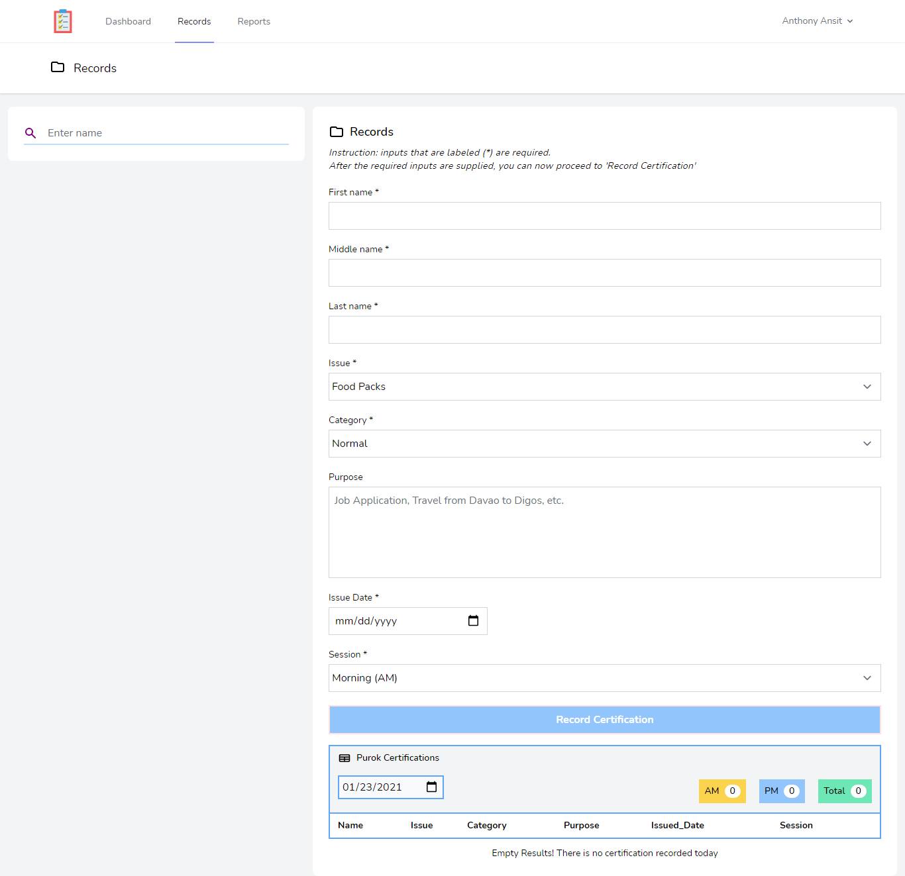

# Documentation

I started this project on January 15, 2021 to solve a problem that my parents are having. To give you a hint what this project is all about and what the problems were solved, I have to also tell you a little information about the beneficiaries of this projects (which are my parents). My father is a *purok leader* which is responsible for a certain purok that he's supervising. Over time, many *barangay projects* were made and my father's workload also summed up. With the pandemic's influence, many small problems have shown up and most of it are in my father's responsibility; from *distributing food rations*, *fixing the streets, basketball courts, parking lots, etc.*, & *giving clearance to people that have affairs with the Barangay*. Clearances in particular, are what mostly this project is dealing with. Everyday, people would come in our house and ask for a certificate/clearance from my father for either their job requirements, or references for other activities.

## Commands for dependencies

### composer
php composer.phar install

### npm
npm install

 
 
 
 
 
